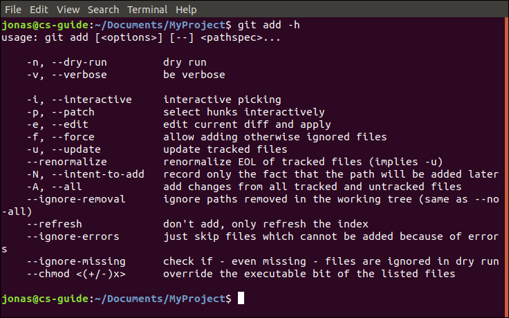

If you have used Git before, you definitely came across the `git add` command. If not, check out my 
<a href="{{ site.baseurl }}">Complete Beginner's Guide to Git</a>.

I noticed that the usage of this command seems to cause a lot of confusion.
Take a look at this article from GitLab for example
([Start using Git on the command line](https://docs.gitlab.com/ee/gitlab-basics/start-using-git.html#add-all-changes-to-commit)):

> To add and commit all local changes in one command:
>
> `git add .`  
> `git commit -m` [...]
>
> Note: The `.` character typically means all in Git.
> {: .notice--primary}

`git add .` does in fact **not** add all local changes! (by the way that is not "one command") 
Adding to the confusion, the command's options have changed after Git version 2.0. 

**Knowing the different options for the `git add` command allows you create smaller and more concise commits.**

Since the [documentation](https://git-scm.com/docs/git-add) can be pretty hard to read I decided to write this article to fully explain all the different options for the add command.
Hopefully this will clear things up!

## What is `git add`?

Git has the concept of a staging area (also called index). The index basically contains a snapshot of your entire project and stores all the files you want to include in your next commit.

It's an intermediate layer between the working directory and the history of the project (consisting of commits). 

Any time the content of a file changes it has to be readded to the staging area. This gives you finer control of the contents of your next commit and prevents you from accidentally committing unwanted changes.

You can precisely choose which files you want to stage including modified, new or deleted files using `git add`. 

Using the `-h` option you can see all the available options for this command and I will explain them (and related commands) in the section [All options explained](#all-options-explained).



## All options explained

In the following sections I'll explain **all** options for the `add` command, which files they affect and when you should use them. 

Starting with the most common options, I'll continue showing you some lesser known ones and give you some info about related commands and interactive staging. 

So, if you're already fairly familiar with the basic `git add`  options, feel free to skip ahead to the [more advanced stuff](#advanced-add-commands).

Please let me know if I missed any in the comments and feel free to give feedback on this list.

### Basic options for `git add`

```
git add .
```

| New files | Modified files | Deleted files |
|-----------|----------------|---------------|
| ✅        | ✅             | ✅            |

Stages all files in the current directory and its subdirectories. The `.` refers to the current directory whereas
`..` would refer to the parent directory.

If your aim is to stage all files, you should only use this command if
you are currently in the root folder of your project (where your `.git` folder is located). Otherwise, not all 
files might be added.

Run `git status` afterwards to confirm that all files have been added or even better:
Use the [`-n`](#git-add-n) option before staging.


```
git add <pathspec>...
```

| New files | Modified files | Deleted files |
|-----------|----------------|---------------|
| ✅        | ✅             | ✅            |


[`<pathspec>...`](https://git-scm.com/docs/gitglossary) is used to add one or multiple specific files or folders that match the given pattern.
This command gives you precise control about which files will be added.

[Empty folders](#how-can-i-add-an-empty-directory) (directories that contain only folders and no files) cannot be added this way and Git will simply ignore them.

**Examples:**

| `git add file.txt`            | only adds `file.txt`                                             |
| `git add file1.txt file2.txt` | adds `file1.txt` and `file2.txt`                                 |
| `git add foo`                 | adds all files and subdirectories within the `foo` folder        |
| `git add foo/*.txt`           | adds all `.txt` files within the `foo` folder and subdirectories |


```
git add -A
```

| New files | Modified files | Deleted files |
|-----------|----------------|---------------|
| ✅        | ✅             | ✅            |

Stages all files in the entire working tree unless a `<pathspec>` is specified. You should generally use this option
if you want to make sure that all new, modified and deleted files in your project will be staged (which is not the case
for `git add .` unless you're in the root directory). 

**Same as:** `git add --all`, `git add --no-ignore-removal`

**Examples:**

| `git add -A .`            | equivalent to `git add .`                                             |
| `git add -A foo/`         | equivalent to `git add foo/`                                          |

**Note:** This is a change introduced in [Git version 2.0](https://github.com/git/git/blob/master/Documentation/RelNotes/1.8.3.txt#L19-L30). Previously, `git add foo/` used to ignore the removal of files,
now it's the same as `git add -A foo/`. This means that the `-A` option is not required anymore when adding a specific folder. Use `git --version` to check your current Git version.
{: .notice--danger}

<a id="git-add-u"></a>
```
git add -u <pathspec>...
```

| New files | Modified files | Deleted files |
|-----------|----------------|---------------|
| :x:       | ✅   			 | ✅      		 |

Restages files that have been added previously and also removes files from the index that have been deleted.
Use this option if you want to exlude added files that are not in the staging area yet.

**Note:** In previous versions, using this option only included files in the current directory and its subdirectories.
Now `-u` refers to the whole working tree (similar to `-A`). 
{: .notice--danger}

```
git add *
```

| New files | Modified files | Deleted files |
|-----------|----------------|---------------|
| ✅        | ✅             | ✅            |

Stages all files except hidden files (those starting with a dot). This means that for example any `.gitignore` or `.config` files in the directory will not be added.

---

### Advanced add commands

In this section I'll cover some options that are not as widely-used but are generally good to know. 

<a id="git-add-n"></a>
```
git add <options> -n
```

This option is used to print all files that will be added before actually staging them. You should prefer this over
running `git add` first followed by `git status` since you would have to unstage any files that you accidentally added.

**Same as:** `git add --dry-run`

**Example:**  
`git add -A -n`: prints 'add `<file>`' for all new, modified and deleted files

```
git add <options> -- <files>
```

Separates the option from specified file names or pathspecs. 

This is used to avoid ambiguities between file names or paths starting with a `-` and option prefixes allowing you
to stage them anyway.

```
git add -i
```

Starts the interactive staging mode in the command line.

Since this is a pretty big topic on its own I'll not cover it in this post.

However, I'm planning to write an article about interactive staging in the future. For a quick first impression, have a look at the [common question](#how-can-i-add-only-newuntracked-files) at the end of this post.

**Same as:** `git add --interactive`

```
git add -e
```

This lets you manually 

```
git add <options> --refresh
```

This option only updates the information Git stores about the files in the index without actually staging them.
So if `git status` seems to print the wrong details, you should try this option. 

```
git add <options> --ignore-errors
```

Sometimes you can run into problems when trying to add files for which you have no permission. This lets you skip the
affected files without exiting with an error.

The remaining files will be staged normally.

```
git add -n <options> --ignore-missing
```

Can only be used in combination with the [`-n`](#git-add-n) option. This will not result in any errors if the given file 
does not exist.

**Example:**  
`git add -n no_file.txt --ignore-missing`: ignores `no_file.txt` if not present


---

### Related commands

The following commands can be used in combination with `git add` or stage files before executing.

```
git commit -a
```

| New files | Modified files | Deleted files |
|-----------|----------------|---------------|
| :x:       | ✅   			 | ✅      		 |

This will stage all the modified and deleted files and then create a commit based on the state of the index.
The `-a` option therefore has the same effect as `-u`. 

It's also common to use `-a` and `-m` at once which can be written as `-am` followed by the commit message.

**Examples:**

| `git commit -a -m "A commit message"`       | equivalent to `git add -u; git commit -m "A commit message"`    |
| `git commit -am "A commit message"`         | same as above                                          |

```
git rm --cached <pathspec>
```

| New files | Modified files | Deleted files |
|-----------|----------------|---------------|
| ✅        | ✅   			 | ✅      		 |

Removes one or multiple files from the index without affecting the working tree. This reverts `git add` and unstages the given files.

**Examples:**

| `git rm --cached .`            				| unstages all files in the current directory 							|
| `git rm --cached file1.txt file2.txt`         | unstages `file1.txt` and `file2.txt` |

```
git reset <commit>
```

Resets the index to a specific commit without affecting the working tree. The changed files will therefore be marked as 
"untracked" when running `git status`.

This command can also be used with the [`-N`](#git-add-n) option.

**Same as:** `git reset --mixed <commit>`

### Interactive staging


```
git add --patch file.txt
```

```
git add -N
```

```
git add -e
```

```
git diff --staged
```
 to check that you staged the correct changes

```
git reset -p
```
to unstage mistakenly added hunks

```
git commit -v
```
to view your commit while you edit the commit message

[Source](https://stackoverflow.com/questions/1085162/commit-only-part-of-a-file-in-git)
https://stackoverflow.com/questions/26042390/git-add-asterisk-vs-git-add-period

## Common questions

### How can I add only modified/tracked files?

If you only want to add modified or deleted files which have already been staged you can use `git update--index --again` ([source](https://stackoverflow.com/a/10015818)). 

Another possibility you can try out is simply using [`git add -u`](#git-add-u).

However, if you decide to exclude specific files from a commit you should consider adding them to a `.gitignore` file. 
This will prevent you from accidentally staging them. 

### How can I add only new/untracked files? 

Often it can be useful to only stage new files that you created and exclude existing files from a commit. Probably the easiest way to do this is using interactive mode which I'll discuss in more detail [here](#interactive-staging). 

Let's say you modified the file `README.md` and recently created the files `index.html` and `404.html`. If you only wanted to add the new `.html` files you could do it like this:

- `git add -i` to start the interactive mode
- type `a` or `4` to choose which untracked files you want to add
- then type `*` to select all files, printing the status using `s` will show you which files have been staged
- type `q` to quit 


If you prefer a single command:


echo -e "a\n*\nq\n"|git add -i


(From [this](https://stackoverflow.com/a/7446711) answer on stackoverflow by [Mat](https://stackoverflow.com/users/635608/mat))

### How can I add an empty directory?

Sometimes you need empty folders to **define a specific folder structure**. The folders can then be populated with files later.

Currently Git does not support staging empty folders. Git only cares about files and not about folders without any content to track. 

One way to solve this problem is by creating a file whose sole purpose is to enable Git to track the "empty" folder. 
You can call this empty file however you want but a convention is to name it `.keep` or better `.gitkeep`.

Alternatively, create a `README.md` or file if you want to add some extra explanation about the purpose of the folder.

This works with any file of course, for example you can simply put a copy of your `LICENSE.md` file in every folder.

If you're certain that the folder will never contain any files, you can also create a `.gitignore` file (using the command `touch .gitignore`) that ignores everything except itself:

```
# Ignore everything in this directory
*
# Except this file
!.gitignore
```

(From this [answer](https://stackoverflow.com/a/932982) by [Jamie Flournoy](https://stackoverflow.com/users/115218/jamie-flournoy))

## Summary

Use `-N` option and `git status`, interactive mode.

## Sources
- [git-scm](https://git-scm.com/docs/git-add) - the official documentation for the `add` command
- [stackoverflow](https://stackoverflow.com/questions/572549/difference-between-git-add-a-and-git-add/) - difference between `git add -A` and `git add .`

## Further reading
Check out the Pro Git book [online](https://git-scm.com/book/en/v2) or as a [print version](https://www.amazon.com/Pro-Git-Scott-Chacon/dp/1484200772?ie=UTF8&camp=1789&creative=9325&creativeASIN=1430218339&linkCode=as2&tag=git-sfconservancy-20) on Amazon if you want to
learn most of the commands and really understand how Git works behind the scenes.
